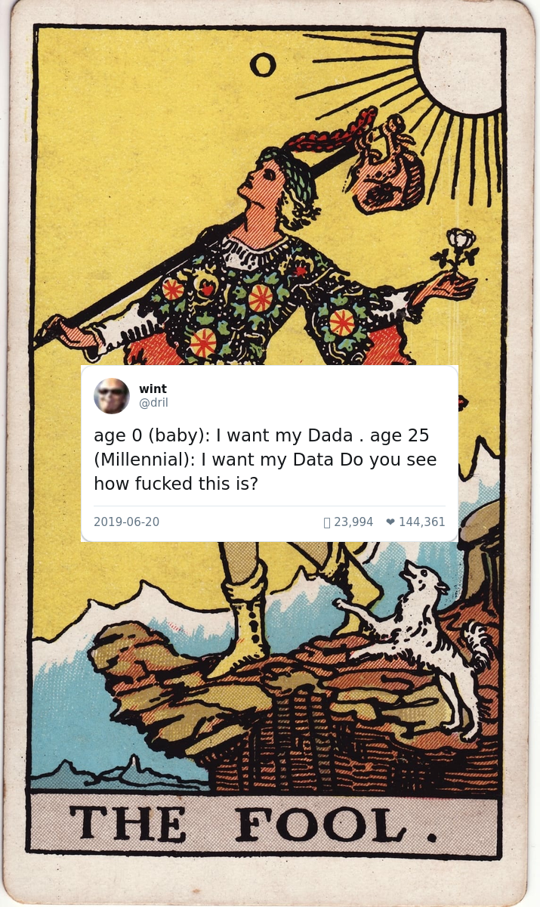
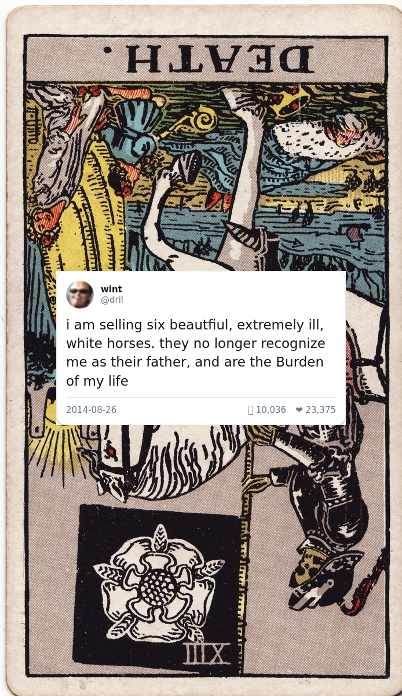
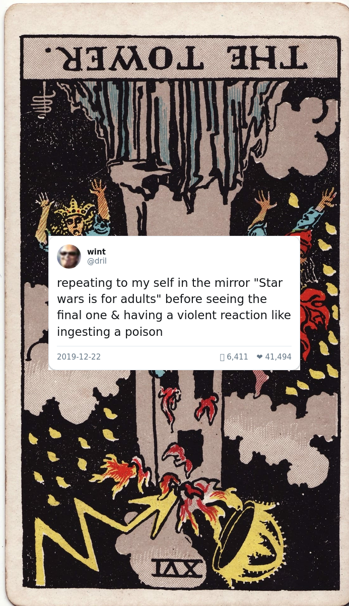

# dril Tarot

Semantic matching of dril tweets to tarot cards using OpenAI embeddings.

## Overview

This matches ~8,900 dril tweets to the 78 tarot cards (upright and reversed positions) using semantic similarity. Each of the 156 card positions gets matched to a unique dril tweet that captures its essence.

## Features

- **Semantic matching**: Uses OpenAI embeddings to find tweets that match card meanings
- **Configurable systems**: Match against Traditional, Crowley, Jungian, or Modern interpretations
- **Popularity weighting**: Balance semantic similarity with tweet virality
- **Strict uniqueness**: Each tweet used exactly once across all 156 positions
- **Visual gallery generation**: (Coming soon) Generate composite images of cards with tweets

## Setup

```bash
# Install dependencies
pip install -r requirements.txt

# Install Playwright browser (for gallery generation)
playwright install chromium

# Set OpenAI API key
export OPENAI_API_KEY='your-key-here'
# Or add to ~/.env file
```

## Usage

### Generate Tweet Matches

```bash
# Basic usage (modern_intuitive system by default)
python3 match_dril_tweets.py

# Use different interpretation system
python3 match_dril_tweets.py --system jungian_psychological

# Adjust popularity weighting
python3 match_dril_tweets.py --min-retweets 100 --popularity-weight 0.2

# Force regenerate tweet embeddings
python3 match_dril_tweets.py --regenerate-embeddings
```

### Generate Gallery Images

**Step 1: Download tarot card images**

```bash
# Automatically download all 78 cards from Internet Archive (recommended)
python3 download_tarot_cards.py

# Or specify custom output directory
python3 download_tarot_cards.py --output my-cards
```

This downloads public domain Rider-Waite Smith cards from Internet Archive and converts them to JPG format. All 78 cards download in ~30-60 seconds.

**Alternative**: Download manually from:
- [Internet Archive](https://archive.org/details/rider-waite-tarot) (recommended)
- [Itch.io CC0 deck](https://luciellaes.itch.io/rider-waite-smith-tarot-cards-cc0)
- Save as: `the-fool.jpg`, `ace-of-wands.jpg`, etc. (lowercase, hyphens)

**Step 2: Generate gallery images**

```bash
# Generate all 156 composite images
python3 generate_dril_tarot_images.py --card-images-dir tarot-cards

# Resume interrupted generation
python3 generate_dril_tarot_images.py --skip-existing

# Specify output directory
python3 generate_dril_tarot_images.py --output my-gallery

# Force regenerate tweet screenshots
python3 generate_dril_tarot_images.py --regenerate-screenshots
```

This generates 156 composite PNG images combining:
- Public domain Rider-Waite Smith tarot cards (1909)
- Classic Twitter-styled dril tweet mockups

Output: `gallery/the-fool-upright.png` through `gallery/king-of-pentacles-reversed.png`

## Data Files

- `data/driltweets.csv` - Corpus of ~8,900 dril tweets with metadata
- `data/dril_tweet_embeddings.json` - Cached tweet embeddings (370MB, auto-generated)
- `data/card_dril_mapping.json` - Generated matches between cards and tweets

## Gallery Examples

Sample dril-tarot cards generated by this project:

<p align="center">
  
  
  
</p>

## Requirements

This project uses the [semantic-tarot](https://github.com/yourusername/semantic-tarot) project as a submodule for:
- Tarot card data and interpretations
- Card embeddings for semantic matching
- Core embedding functionality

## Design Documents

See `docs/plans/` for detailed design documents:
- [Dril Tweet Matcher Design](docs/plans/2025-12-12-dril-tweet-matcher-design.md)
- [Gallery Image Generator Design](docs/plans/2025-12-12-dril-tarot-gallery-design.md)

## License

MIT License - see LICENSE file for details

Dril tweets are from [@dril](https://twitter.com/dril) and remain their copyright.
